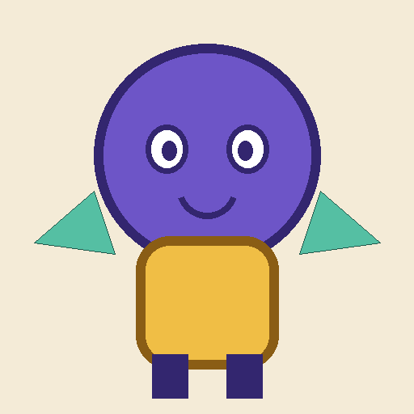
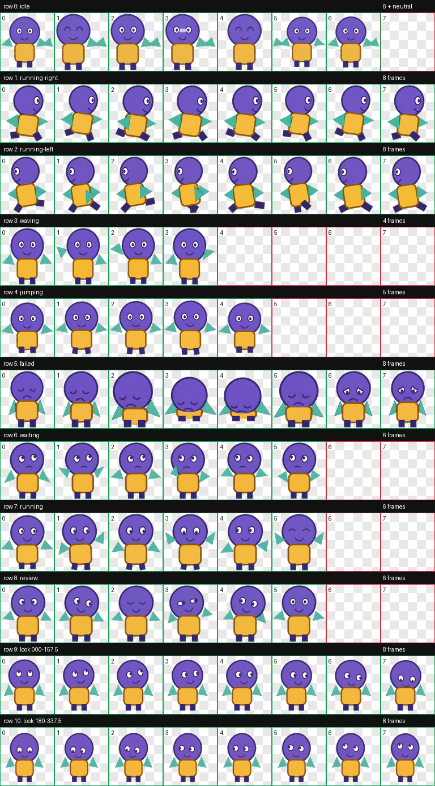
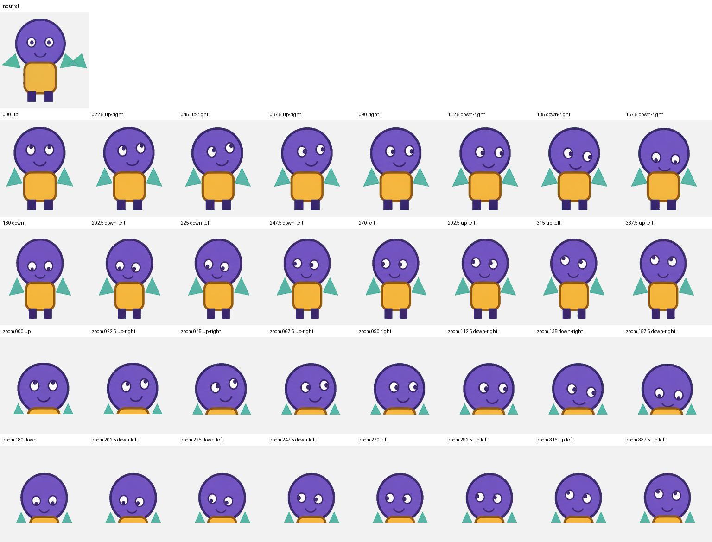

# Codex Pet Maker

<p align="center">
  
</p>

> ## One image. Your own Codex pet.
>
> Turn a single reference image into a validated, install-ready animated
> Codex v2 pet.

Codex Pet Maker handles the repetitive work—resumable generation, targeted
retries, atlas assembly, direction checks, and packaging—so you can focus on
the character instead of managing the pipeline.

> **Status:** public `v0.1.0-rc.1` release candidate.

## Features

- Resumes interrupted runs without repeating completed stages.
- Returns one compact next action instead of re-planning the full workflow.
- Builds and validates the standard Codex v2 animation atlas.
- Checks transparency, dimensions, animation structure, and viewing directions.
- Retries only failed visual stages and stops at fixed retry limits.
- Packages the validated `pet.json` and `spritesheet.webp` pair.

## Effect showcase

`Shape Scout` is a synthetic geometric test pet. Its reference was generated
programmatically and contains no personal media.

### Synthetic reference



### Animation states



### Direction validation



## Optimization results

Measured on the isolated `Shape Scout` end-to-end test:

| Metric | Result |
|---|---:|
| Controller-managed visual jobs | 13 |
| Visual generation attempts | 13 |
| Retries | 0 |
| Blockers | 0 |
| Balanced visual-review passes | 1 |
| Direction verdicts | 16/16 passed |
| Atlas | 1536×2288, 8×11, RGBA WebP |
| Validation errors / warnings | 0 / 0 |
| Transparent RGB residue | 0 pixels |
| Controller output budget | ≤ 1.5 KB per action |
| Largest measured controller action | 872 bytes |
| Completed-stage re-planning | 0 |
| Skill size | 89 lines / 4.49 KB |
| Conservative context replay | 109,515 → 11,964 tokens |
| Measured orchestration-context reduction | 89.08% |

The token comparison is a deterministic local orchestration-context replay
using the same synthetic workload. It is not API billing, hidden reasoning,
image-generation, cached-input, or output-token data. See
[BENCHMARK.md](BENCHMARK.md) for the method, caveats, and reproduction command.

## Installation

### Requirements

- Codex or the ChatGPT desktop app with Plugin support
- Git

### Install from GitHub

Add this repository as a Plugin Marketplace:

```powershell
codex plugin marketplace add haishanstudying/codex-pet-maker-public
```

Install the Plugin:

```powershell
codex plugin add codex-pet-maker@codex-pet-maker
```

Restart the desktop app or Codex session, then start a new task so the bundled
skill is loaded.

### Install from the graphical Plugin browser

1. Add the Marketplace with the command above.
2. Restart the ChatGPT desktop app.
3. Open **Plugins** and select the **Codex Pet Maker** source.
4. Open **Codex Pet Maker** and select the plus button.
5. Start a new task after installation.

In Codex CLI, run `codex`, enter `/plugins`, select the Marketplace, and install
the Plugin from its detail page.

### Verify

```powershell
codex plugin marketplace list
codex plugin list
```

Then start a new task and try:

```text
Use Codex Pet Maker to create a pet from this reference image.
```

### Update

```powershell
codex plugin marketplace upgrade codex-pet-maker
codex plugin add codex-pet-maker@codex-pet-maker
```

Restart Codex and test the updated Plugin in a new task.

### Uninstall

Open the Plugin in the desktop or CLI Plugin browser and select **Uninstall
plugin**. To stop tracking this Marketplace after uninstalling:

```powershell
codex plugin marketplace remove codex-pet-maker
```

## Quick start

Example requests:

```text
Create and install a Codex pet from my reference image.
Resume my interrupted Codex pet generation run.
Validate and package my generated Codex pet.
```

The balanced workflow generates only the next requested visual job, assembles
the atlas deterministically, performs one visual review, and repairs only the
stage that failed.

## Privacy

The repository contains only one synthetic brand logo and the three
checksum-pinned synthetic `Shape Scout` demo images shown above. It contains no
user reference images, private pets, prompts, run logs, or telemetry.

Runtime references and generated files stay in a separate run directory. When
image generation is requested, only references attached to the current run are
processed by the configured image-generation service. See
[PRIVACY.md](PRIVACY.md) for details.

## Support

- Read [SUPPORT.md](SUPPORT.md) or open a
  [GitHub Issue](https://github.com/haishanstudying/codex-pet-maker-public/issues).
- Review [SECURITY.md](SECURITY.md) before reporting a vulnerability.
- Check [CHANGELOG.md](CHANGELOG.md) for version notes.
- For installation problems, confirm the Marketplace appears in
  `codex plugin marketplace list`, restart Codex, and test in a new task.

## OpenAI Plugin Directory submission

Portal-ready listing copy, release notes, and the required five positive and
three negative review cases are available in [submission](submission/).

## License

Licensed under the Apache License 2.0. See [LICENSE](LICENSE) and [NOTICE](NOTICE).

Plugin packaging and Marketplace behavior follow the
[OpenAI Plugin documentation](https://developers.openai.com/plugins/build/plugins).
